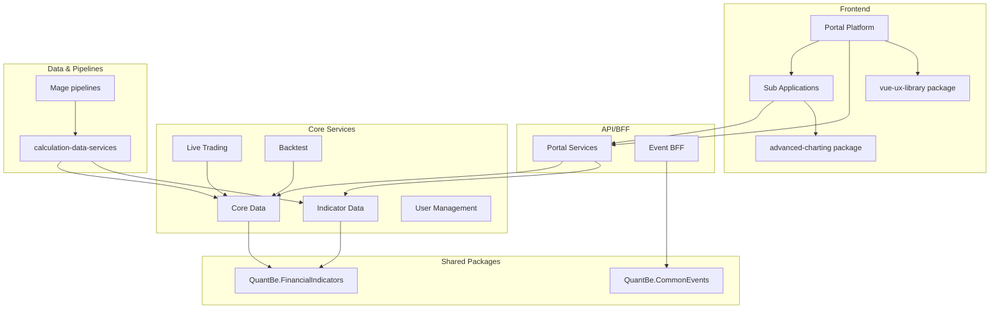

# Target Architecture (Phase 1)

Notes:
- CI/CD baseline moved to Azure DevOps YAML pipelines.
- GitHub Actions removed from KEEP repos audited in Phase 1.
- Deprecated/empty/POC repos archived per Phase 1 scope.
